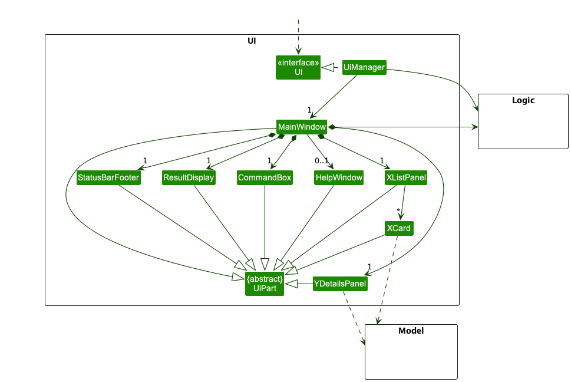
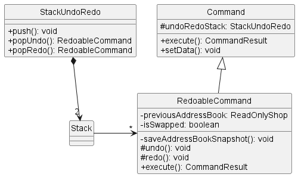
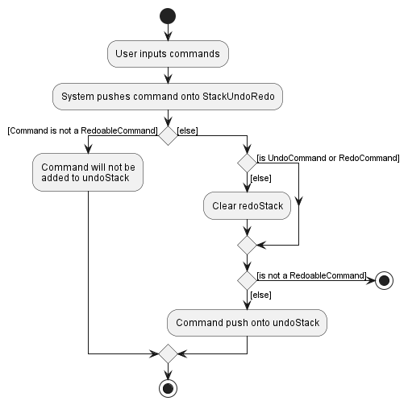
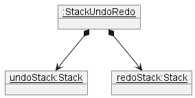
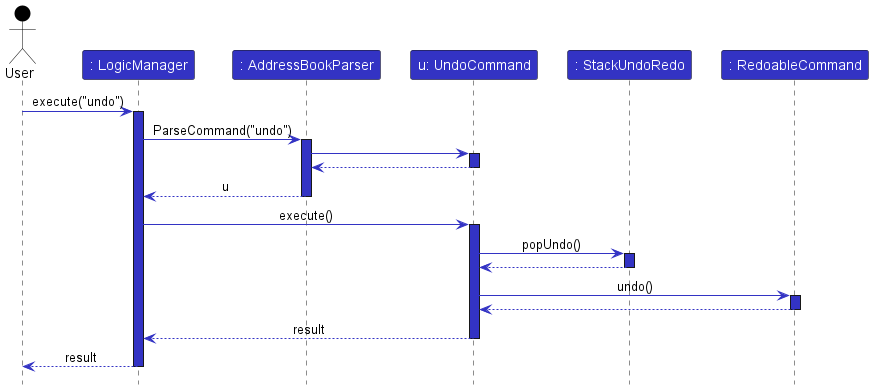
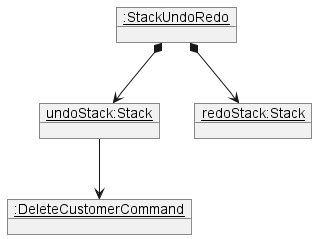

* Table of Contents
{:toc}

--------------------------------------------------------------------------------------------------------------------

## **Acknowledgements**

* {list here sources of all reused/adapted ideas, code, documentation, and third-party libraries -- include links to the original source as well}

--------------------------------------------------------------------------------------------------------------------

## **Setting up, getting started**

Refer to the guide [_Setting up and getting started_](SettingUp.md).

--------------------------------------------------------------------------------------------------------------------

## **Design**

:bulb: **Tip:** The `.puml` files used to create diagrams in this document can be found in the [diagrams](https://github.com/AY2223S2-CS2103-W17-4/tp/tree/master/docs/diagrams/) folder. Refer to the [_PlantUML Tutorial_ at se-edu/guides](https://se-education.org/guides/tutorials/plantUml.html) to learn how to create and edit diagrams.

### Architecture

The ***Architecture Diagram*** given above explains the high-level design of the App.

Given below is a quick overview of main components and how they interact with each other.

**Main components of the architecture**

**`Main`** has two classes called [`Main`](https://github.com/AY2223S2-CS2103-W17-4/tp/tree/master/src/main/java/seedu/address/Main.java) and [`MainApp`](https://github.com/AY2223S2-CS2103-W17-4/tp/tree/master/src/main/java/seedu/address/MainApp.java). It is responsible for,
* At app launch: Initializes the components in the correct sequence, and connects them up with each other.
* At shut down: Shuts down the components and invokes cleanup methods where necessary.

[**`Commons`**](#common-classes) represents a collection of classes used by multiple other components.

The rest of the App consists of four components.

* [**`UI`**](#ui-component): The UI of the App.
* [**`Logic`**](#logic-component): The command executor.
* [**`Model`**](#model-component): Holds the data of the App in memory.
* [**`Storage`**](#storage-component): Reads data from, and writes data to, the hard disk.

**How the architecture components interact with each other**

The *Sequence Diagram* below shows how the components interact with each other for the scenario where the user attempts to delete a customer/service/appointment/part/technician who has the id of 1  (i.e. `deletecustomer 1`).

This diagram is applicable also for other commands such as the add equivalent.

Omitted from this image is that the `XCommand`, being an  instance of`RedoableCommand`, methods related to it is handled here. For more information, scroll down to the relevant section below.

Each of the four main components (also shown in the diagram above),

* defines its *API* in an `interface` with the same name as the Component.
* implements its functionality using a concrete `{Component Name}Manager` class (which follows the corresponding API `interface` mentioned in the previous point.

For example, the `Logic` component defines its API in the `Logic.java` interface and implements its functionality using the `LogicManager.java` class which follows the `Logic` interface. Other components interact with a given component through its interface rather than the concrete class (reason: to prevent outside component's being coupled to the implementation of a component), as illustrated in the (partial) class diagram below.

The sections below give more details of each component.

### UI component

The **API** of this component is specified in [`Ui.java`](https://github.com/AY2223S2-CS2103-W17-4/tp/tree/master/src/main/java/seedu/address/ui/Ui.java)

The UI consists of a `MainWindow` that is made up of parts e.g.`CommandBox`, `ResultDisplay`, `XListPanel` (`X` is a placeholder for a specific model list panel  e.g., `CustomerListPanel`, `VehicleListPanel`), `StatusBarFooter` etc. All these, including the `MainWindow`, inherit from the abstract `UiPart` class which captures the commonalities between classes that represent parts of the visible GUI.

The `UI` component uses the JavaFx UI framework. The layout of these UI parts are defined in matching `.fxml` files that are in the `src/main/resources/view` folder. For example, the layout of the [`MainWindow`](https://github.com/AY2223S2-CS2103-W17-4/tp/tree/master/src/main/java/seedu/address/ui/MainWindow.java) is specified in [`MainWindow.fxml`](https://github.com/AY2223S2-CS2103-W17-4/tp/tree/master/src/main/resources/view/MainWindow.fxml)

The `UI` component,

* executes user commands using the `Logic` component.
* listens for changes to `Model` data so that the UI can be updated with the modified data.
* keeps a reference to the `Logic` component, because the `UI` relies on the `Logic` to execute commands.
* depends on some classes in the `Model` component, as it displays specific objects residing in the `Model` such as the `Customer`, `Vehicle`, `Service`, `Appointment` and `PartMap` objects.
* also depends on some mapping classes in the `Model` component as certain objects have an integer array of object ids that refer to another object. One example is the Customer class, which has a `HashSet<Integer>` of `Vehicle` IDs. To associate each `Customer` object with the corresponding `Vehicle` objects, the Model uses an object called `CustomerVehicleMap`. The `UI` component then displays the relevant objects based on these mappings. In essence, the `Model` uses these mapping classes to ensure that objects with references to one another are properly connected and displayed in the user interface.

### Logic component

**API** : [`Logic.java`](https://github.com/AY2223S2-CS2103-W17-4/tp/tree/master/src/main/java/seedu/address/logic/Logic.java)

Here's a (partial) class diagram of the `Logic` component:

How the `Logic` component works:
1. When `Logic` is called upon to execute a command, it uses the `AddressBookParser` class to parse the user command.
1. This results in a `Command` object (more precisely, an object of one of its subclasses e.g., `AddCustomerCommand`) which is executed by the `LogicManager`.
1. The command can communicate with the `Model` when it is executed (e.g. to add a customer).
1. The result of the command execution is encapsulated as a `CommandResult` object which is returned back from `Logic`.

The Sequence Diagram below illustrates the interactions within the `Logic` component for the `execute("deletecustomer 1")` API call.

:information_source: **Note:** The lifeline for `DeleteCommandParser`  and `DeleteCommand` should end at the destroy marker (X) but due to a limitation of PlantUML, the lifeline reaches the end of diagram.

This diagram is applicable to all `deleteXCommand` commands except `deletePartCommand` on the point where instead of an integer (i.e. the ID), it takes in a String (i.e. the part name).

Omitted from this image is regarding `XCommand` are:
1. How Undo and Redo is utilized by the XCommand
2. How the cascading delete commands work (i.e. delete vehicles, delete appointments).
    * This is not added because it similar in nature as to how remove vehicle works.
    * Cascading may be applicable to other functions such as `addX`

For more information regarding undo and redo., scroll down to the relevant section below.

Here are the other classes in `Logic` (omitted from the class diagram above) that are used for parsing a user command:

How the parsing works:
* When called upon to parse a user command, the `AddressBookParser` class creates an `XCommandParser` (`X` is a placeholder for the specific command name e.g., `AddCustomerCommandParser`) which uses the other classes shown above to parse the user command and create a `XCommand` object (e.g., `AddCustomerCommand`) which the `AddressBookParser` returns back as a `Command` object.
* All `XCommandParser` classes (e.g., `AddCustomerCommandParser`, `DeleteCustomerCommandParser`, ...) inherit from the `Parser` interface so that they can be treated similarly where possible e.g, during testing.

### Model component
**API** : [`Model.java`](https://github.com/AY2223S2-CS2103-W17-4/tp/tree/master/src/main/java/seedu/address/model/Model.java)

The `Model` component,

* stores the address book data i.e., all `X` objects (which are contained in a `UniqueXList` object) where X are Customer/Service/Appointments/Vehicles/Technicians, and all `Part` objects (which are contained in a `partMap` object).
* in the case of X, stores the currently 'selected' `X` objects (e.g., results of a search query) as a separate _filtered_ list which is exposed to outsiders as an unmodifiable `ObservableList<X>` that can be 'observed' e.g. the UI can be bound to this list so that the UI automatically updates when the data in the list change.
* in the case of Part, stores the currently 'selected' `Part` objects (e.g., results of a search query) as a separate hashmap.
* in the case of ServiceList, it acts functionally the same as an `UniqueXList` except that the entry can be non-unique.
* stores a `UserPref` object that represents the user’s preferences. This is exposed to the outside as a `ReadOnlyUserPref` objects.
* does not depend on any of the other three components (as the `Model` represents data entities of the domain, they should make sense on their own without depending on other components)

### Storage component

**API** : [`Storage.java`](https://github.com/AY2223S2-CS2103-W17-4/tp/tree/master/src/main/java/seedu/address/storage/Storage.java)

The `Storage` component,
* can save both AutoM8 shop data and user preference data in json format, and read them back into corresponding objects.
* inherits from both `ShopStorage` and `UserPrefStorage`, which means it can be treated as either one (if only the functionality of only one is needed).
* depends on some classes in the `Model` component (because the `Storage` component's job is to save/retrieve objects that belong to the `Model`)

### Common classes

Classes used by multiple components are in the `seedu.addressbook.commons` package.

--------------------------------------------------------------------------------------------------------------------

## **Implementation**

This section describes some noteworthy details on how certain features are implemented.

### Add Feature

### Current Implementation
The add function is facilitated by `AddXCommand` (`X` is a placeholder for the specific entity to be added e.g. `AddCustomerCommand`)

Here `X` can be `Customer/Appointment/Service/Vehicle/Part/Technician`.

The Sequence Diagram below illustrates the interactions within the Logic component for the `execute("addX args*")` API call, , where `argks*` represents the various arguments needed for the function to run.

The `addX(x)` method of `Model` adds the entity into the system via adding the entity into `Shop`.

Limitations of plant UML prevents us from putting an X at the correct spot. 

Omitted from the diagram above is:
1. How Undo and Redo is implemented
2. The other relevant add commands. For example, `addvehicle` requires `owner id` which would affect the relevant customer by adding the vehicle to that user. 

### Edit Feature

### Current Implementation
The edit function is facilitated by `EditXCommand` (`X` is a placeholder for the specific entity to be added e.g. `EditCustomerCommand`)

Here `X` can be `Customer/Appointment/Service/Vehicle/Part/Technician`.

The Sequence Diagram below illustrates the interactions within the Logic component for the `execute("editX args*")` API call, where `argks*` represents the various arguments needed for the function to run. 

The `editX(x)` method of `Model` adds the entity into the system via adding the entity into `Shop`.

Limitations of plant UML prevents us from putting an X at the correct spot.

Omitted from the diagram above is:
1. How Undo and Redo is implemented
2. The other relevant add commands. For example, `addvehicle` requires `owner id` which would affect the relevant customer by adding the vehicle to that user.

### View Feature

### Current Implementation

The view function is facilitated by `ViewXCommand` (`X` is a placeholder for the specific command name e.g., `ViewCustomerCommand`).

Here X can be appointment/customer/service/technician/vehicle.

The Sequence Diagram below illustrates the interactions within the Logic component for the execute("viewcustomer 1") API call.

This feature is implemented this way to best match how existing list and find function is done.

This is done this way so that the code is easily maintainable and readable if once the developer understands how `listX` functions works.

However, as you may have noticed, `ViewPartCommand`'s diagram differs slightly.

The Sequence Diagram that illustrates the interactions within the Logic component for the execute("viewpartcommand 1") API call is to be added.

* To add image *

### TotalAppointmentCommand Feature

#### Current Implementation

The `totalAppointmentCommand` feature mainly involves iterating through the appointment list and checking if the specified date falls on the same date as the appointment. The way that the validation check is done is by setting the previous day to be the start date and the next day to be the end date. Finally, we check if the current appointment is within the start and end date.

### Undo/Redo Feature

#### Current Implementation

The undo/redo mechanism is facilitated by `StackUndoRedo`. The implemented undo/redo feature would be best described as two stacks of commands that the user has performed:

- `undoStack` serves to store a "history" of the commands they have performed.
- `redoStack` is a collection of their commands that lead up to initial state at which they started performing the undo.

The central concept is to store a stack of commands that essentially functions as a history-list of the commands. Essentially, we leverage on the stack's data structure which is a linear data structure based on the principle of Last In First Out (LIFO). Based on the implementation described above, `undoStack` is populated by pushing a user's command in the application.

Then, when the user performs an undo, the command is firstly popped from `undoStack` and used to restore previous state, and then we store that command onto `redoStack`.

`StackUndoRedo` contains 2 stacks, `undoStack` and `redoStack`. The `undoStack` and `redoStack` contain commands that are of type `RedoableCommand`. `RedoableCommand` extends Command and has the following attributes and methods.

When a `RedoableCommand` is being executed, the methods `saveAddressBookSnapshot(Model model)` will be called. This ensures that the current states are stored within the command.

After a command is executed, it will be added into the `StackUndoRedo`. The specific process is explained in the activity diagram below.

Next, when undo is being performed, `undoStack` will remove the first command in its stack and add it to `redoStack`. It will then call `RedoableCommand` `undo()` of the command that is removed. The `undo()` method will then set the model to the previous snapshot of `saveAddressBookSnapshot`.

Likewise, when redo is being performed, `redoStack` will remove the first command in its stack and add it to `undoStack`. It will then call `RedoableCommand` `redo()` of the command that is removed. The `redo()` method will then execute the command again.

Given below is an example of a usage scenario and how the undo/redo mechanism behaves at each step.

Step 1. The user launches the application. The `StackUndoRedo` will be initialized.

Step 2. The user executes delete command. The delete command will be pushed into the `undoStack` of `StackUndoRedo`.

Step 3. The user executes add customer command to add a new customer. Similarly, the add command will be pushed into the `undoStack` of `StackUndoRedo`.

Step 4. The user now decides that adding of customer was a mistake, and decides to undo that action by executing the undo command.

> <b>Note:</b> undoCommand will check if there is any command that can be undone by calling `StackUndoRedo` canUndo() method.

The following sequence diagram shows how the undo operation works:

> <b>Note:</b> The redo command will call `popRedo()` method in `StackUndoRedo`and `redo()` method in `RedoableCommand` .

Step 5. The user executes listcustomers. Due to not being an `UndoCommand` or `RedoCommand`, it causes the `redoStack`
to be cleared.  Commands that are not undoable are not added into the `undoStack`.

#### Design considerations:

**Aspect: How undo & redo executes:**

* **Alternative 1 (current choice):** Saves the entire address book.
    * Pros: Implementation is easy.
    * Cons: Memory usage may cause performance issues.

* **Alternative 2:** Individual command has attached logic that allows it to undo/redo by itself.
    * Pros: Will use less memory (e.g. just save what is being deleted).
    * Cons: Must ensure that the implementation of each command is correct. Adds a lot of complexity that may not seem justified as it is to only accommodate the undo/redo feature.

**Aspect: Data structure to support the undo/redo commands:**

* **Alternative 1 (current choice):** Use 2 stacks to store the history of the Models.
    * Pros: Implementation is easier and the logic would be much more manageable to debug.
    * Cons: Duplicated Logic.

* **Alternative 2:** Use `HistoryManager` for undo/redo.
    * Pros: Does not need to maintain separate stacks and able to use what is in the codebase.
    * Cons: Single Responsibility Principle and Separation of Concerns are violated as `HistoryManager` would need to handle more than one thing. For example, it would need to handle the undo and redo as well as the history of the application. This is in contrast with a HistoryManager which is only responsible for the history of the application.

### \[Proposed\] Data archiving

1. If impact of loading save file:
    * Save file leads to complete file loss, warn user and attempt to load save backup.
    * If that fails, warn user that data is not recoverable and advice not to perform any action.
2. Archive after every few saves, so that the user can revert to a specific save.
3. Upon exit, save backup should be made.

### Planned Enhancements

**Mitigating the effects of malicious save file edit**

* Issue 1: An malicious user is able to modify the save file 
  * Proposed solution: encrypting the save file and storing hash
  

* Issue 2: An malicious user is able to modify the save file such that running a command may have adverse effects on other parts of the program.
  * Example: Malicious user edits save file and adds `vehicle id` (i.e. vehicle id 5) to a customer, but the `vehicle` (with id 5) does not belong to the user.
  * Effects: Command `Deletecustomer` will delete the vehicle with id 5
  * Proposed solution: Implement post load save checks to ensure that vehicle to customer mapping is 1:1 on both vehicle and customer end.
  * Note: This is applicable for all entries that have some form of mapping.

--------------------------------------------------------------------------------------------------------------------

## **Documentation, logging, testing, configuration, dev-ops**

* [Documentation guide](Documentation.md)
* [Testing guide](Testing.md)
* [Logging guide](Logging.md)
* [Configuration guide](Configuration.md)
* [DevOps guide](DevOps.md)

--------------------------------------------------------------------------------------------------------------------

## **Appendix: Requirements**

### Product scope

**Target user profile**:

* Auto repair shop owners who want to keep track of their customers, vehicles, logistics and appointments
* prefers desktop apps over other types
* fast typist
* prefers typing to mouse interactions
* is comfortable interacting with CLI apps

**Value proposition**: AutoM8 provides a platform that allows auto repair shop owners to manage their customer information, service details and logistics

### User stories

Priorities: High (must have) - `* * *`, Medium (nice to have) - `* *`, Low (unlikely to have) - `*`

| Priority | As a …​                                    | I want to …​                                  | So that I can…​                                                  |
| -------- |--------------------------------------------|-----------------------------------------------|------------------------------------------------------------------|
| `* * *`  | Auto repair shop owner                     | add appointments I'm attending                | Keep track of appointments for the day                           |
| `* * *`  | Auto repair shop owner                     | add vehicle I want to fix                     | Keep track of vehicle                                            |
| `* * *`  | Auto repair shop owner                     | add spare parts                               | Keep track of how many spare parts remaining                     |
| `* * *`  | Auto repair shop owner                     | add customer                                  | Keep track of customer details                                   |
| `* * *`  | Auto repair shop owner                     | map which car plate belongs to which customer | hand the right car to the appropriate owner                      |
| `* * *`  | Auto repair shop owner                     | delete a contact                              | remove entries I no longer need                                  |
| `* * *`  | Auto repair shop owner                     | find a contact                                | locate details of that contact without searching the entire list |
| `* * *`  | Auto repair shop owner                     | sort vehicles by brand                        | divide the vehicles                                              |
| `* * *`  | Auto repair shop owner                     | edit a contact                                | make changes in case of mistakes                                 |

*{More to be added}*

### Use cases

AutoM8 provides the necessary features that support the management of customer, vehicle, servicing, appointment information such as adding, deleting, listing, sorting, finding and editing. The Use Cases listed below demonstrate their usages.

(For all use cases below, the **System** is `AutoM8` and the **Actor** is the `user`, unless specified otherwise)
  

**Use case: UC01 - Listing all customers**

**MSS**
1. User requests to list out all customers.
2. AutoM8 shows a list of all customers.

   Use case ends.

**Extensions**

- 2a. The list is empty.
  Use case ends.
    

**Use case: UC02 - Listing all vehicles**

similar to use case one. 

**Use case: UC03 - Listing all appointments**

similar to use case one.

**Use case: UC04 - Listing all spare parts**

similar to use case one.

**Use case: UC05 - Listing all services**

similar to use case one.

**Use case: UC06 - Listing all technicians**

similar to use case one.

**Use case: UC07 - Adding a customer**

**MSS**

1. User requests to add a customer as a contact.
2. User inputs the information of the customer.
3. AutoM8 adds the customer as a contact.

   Use case ends.

**Extensions**

- 3a. The given name already exists in AutoM8.
    - 3a1. AutoM8 shows an error message.
      Use case resumes at step 2.
        

**Use case: UC08 - Adding a vehicle**

similar to use case seven.

**Use case: UC09 - Adding an appointment**

similar to use case seven.

**Use case: UC10 - Adding a spare part**

similar to use case seven.

**Use case: UC11 - Adding a service**

similar to use case seven.

**Use case: UC12 - Adding a technician**

similar to use case seven.

**Use case: UC13 - Adding a technician to a service**

**MSS**

1. User requests to add a technician to a service.
2. User inputs the information of the service.
3. AutoM8 adds the service into the book.

   Use case ends.

**Extensions**

- 3a. The given technician already has a service assigned in AutoM8.
    - 3a1. AutoM8 shows an error message.
      Use case resumes at step 2.
        
- 3b. The provided index for technician and/or service is invalid.
    - 3a1. AutoM8 displays an error message.
        

**Use case: UC13 - Adding a spare part to a service**

similar to use case thirteen.

**Use case: UC14 - Editing a customer's details**

**MSS**

1. User requests to <u>list contacts (UC01)</u>.
2. AutoM8 shows a list of customers.
3. User requests to edit a contact on the list.
4. User inputs the updated information.
5. AutoM8 updates the contact's details.

   Use case ends.

**Extensions**
- 2a. The list is empty.
  Use case ends.
- 3a. The provided index is invalid.
    - 3a1. AutoM8 displays an error message.

      Use case resumes at step 2.
        

**Use case: UC15 - Editing a vehicle's details**

similar to use case fourteen.

**Use case: UC13 - Editing appointment details**

similar to use case fourteen.>

**Use case: UC14 - Editing an appointment details**

similar to use case fourteen.

**Use case: UC15 - Editing a service details**

similar to use case fourteen.

**Use case: UC16 - Editing a technician details**

similar to use case fourteen.

**Use case: UC17 - Deleting a customer**

**MSS**
1. User requests to <u>list customers (UC01)</u>.
2. AutoM8 shows a list of customers.
3. User requests to delete a customer at a given index.
4. AutoM8 deletes the customer at the index.

   Use case ends.

**Extensions**
- 2a. The list is empty.
  Use case ends.
- 3a. The provided index is invalid.
    - 3a1. AutoM8 displays an error message.

      Use case resumes at step 2.
        

**Use case: UC18 - Deleting a vehicle**

similar to use case seventeen.

**Use case: UC19 - Deleting an appointment**

similar to use case seventeen.

**Use case: UC20 - Deleting a spare part**

similar to use case seventeen.

**Use case: UC21 - Deleting a service**

similar to use case seventeen.

**Use case: UC22 - Deleting a technician**

similar to use case seventeen.

**Use case: UC23 - Sorting customers**

**MSS**
1. User requests to <u>list customers (UC01)</u>.
2. AutoM8 shows a list of customers.
3. User requests to sort customers in list.
4. AutoM8 sorts vehicles according to user's requirements.

   Use case ends.

**Extensions**
- 2a. The list is empty.
  Use case ends.
- 3a. No fields are specified.
    - 3a1. AutoM8 displays an error message.

      Use case resumes at step 2.
        

**Use case: UC24 - Sorting appointment**

similar to use case twenty-three.

**Use case: UC25 - Sorting appointment**

similar to use case twenty-three.

**Use case: UC26 - Sorting services**

similar to use case twenty-three.

**Use case: UC27 - Sorting technician**

similar to use case twenty-three.

**Use case: UC28 - Find a vehicle**

**MSS**

1. User requests to <u>list of customer as contacts (UC02)</u>.
2. AutoM8 shows a list of vehicles.
3. User requests to find vehicle on the list.
4. AutoM8 find customer according to user's requirements.

   Use case end.

**Extensions**
- 2a. The list is empty.
  Use case ends.
- 3a. The provided index is invalid.
    - 3a1. AutoM8 displays an error message.

      Use case resumes at step 2.
        

**Use case: UC29 - Find a service**

similar to use case twenty-eight.

**Use case: UC30 - View a customer**

**MSS**
1. User requests to <u>list customers (UC01)</u>.
2. AutoM8 shows a list of customers.
3. User requests to view a customer at a given index.
4. AutoM8 views the customer at the index.

   Use case ends.

**Extensions**
- 2a. The list is empty.
  Use case ends.
- 3a. The provided index is invalid.
    - 3a1. AutoM8 displays an error message.

      Use case resumes at step 2.
        

**Use case: UC31 - View an appointment**

similar to use case thirty.

**Use case: UC32 - View a service**

similar to use case thirty.

**Use case: UC33 - View a technician**

similar to use case thirty.

**Use case: UC33 - View a vehicle**

similar to use case thirty.

**Use case: UC34 - Undo previous command**

**MSS**

1.  User keys undo.
2.  System undoes the previous command executed.

Use case ends.

**Extensions**

* 1a. Previous command was `add`, `edit` or `delete` and user tries to undo.

    * 1a1. System will not the previous command and displays an error message.  
      Use case ends.

**Use case: UC35 - Redo previous command**
1. User requests to redo.
2. System redoes the last action.

Use case ends.

**Extensions**
- 1a. There is no command to redo.
    - 3a1. System displays an error message.  
      Use case ends.

**Use case: UC36 - Exiting the application**

**MSS**

1. User requests to exit AutoM8.
2. AutoM8 closes.

   Use case ends.
     

### Non-Functional Requirements

1. The application should be _free_.
2. It should be easy to understand and use, even for users with little to no experience.
3. Offline application used by each person.
4. The application should be able to operate on any _mainstream OS_ such as Linux, MacOS and Windows so long as Java 11 or above is installed.
5. The product should be highly testable.
6. Use of clear and concise English should be observed in the documentation
7. This product does not necessarily need to be installed but can run as an executable.
8. Contain clear and easy to understand error messages
9. Should be able to support up to 1000 persons without any noticeable lag in performance for typical usage.
10. A user that possess above average typing speed for regular text (i.e. not code, not system admin commands) should be able to achieve majority of the task faster using commands than using the mouse.

### Glossary

* **Mainstream OS**: Windows, Linux, Unix, OS-X
* **Vehicle**: A 4-wheel machine used to transport people
* **Plate number**: An identifier put on the front and back of a vehicle
* **Spare parts**: A duplicate part of a vehicle that can be used to replace a broken part in a car

--------------------------------------------------------------------------------------------------------------------

## **Appendix: Instructions for manual testing**

Given below are instructions to test the app manually.

:information_source: **Note:** These instructions only provide a starting point for testers to work on;
testers are expected to do more *exploratory* testing.

### Launch and shutdown

1. Initial launch

   1. Download the jar file and copy into an empty folder

   1. Double-click the jar file Expected: Shows the GUI with a set of sample contacts. The window size may not be optimum.

1. Saving window preferences

   1. Resize the window to an optimum size. Move the window to a different location. Close the window.

   1. Re-launch the app by double-clicking the jar file. 
       Expected: The most recent window size and location is retained.

### Deleting a customer

1. Deleting a customer while all customers are being shown

   1. Prerequisites: List all customers using the `listcustomer` command. Multiple persons in the list.

   1. Test case: `deletecustomer 1` 
      Expected: Customer with id of 1 is deleted from the list. Details of the deleted contact shown in the status message. 

   1. Test case: `deletecustomer 0` 
      Expected: No person is deleted. Error details shown in the status message. Status bar remains the same.

   1. Other incorrect delete commands to try: `deletecustomer`, `deletecustomer x`, `...` (where x is larger than the list size) 
      Expected: Similar to previous.

### Saving data

1. Dealing with missing/corrupted data files

   1. _{explain how to simulate a missing/corrupted file, and the expected behavior}_

1. _{ more test cases …​ }_
